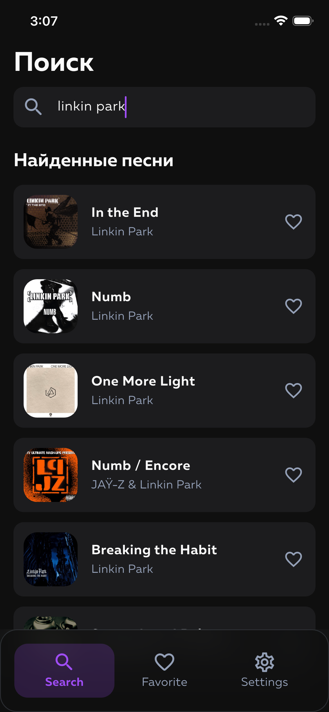
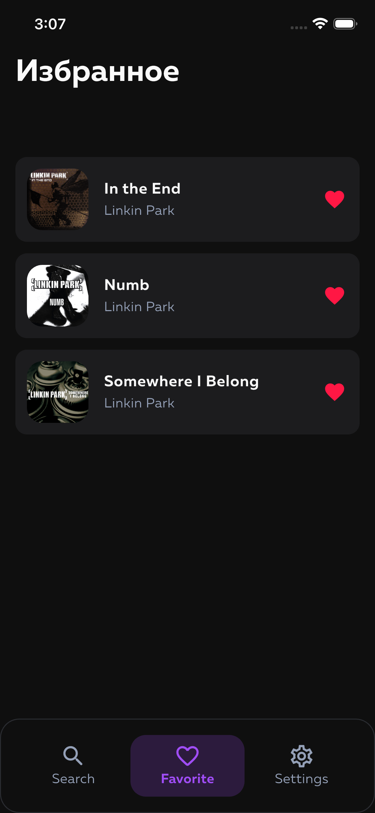
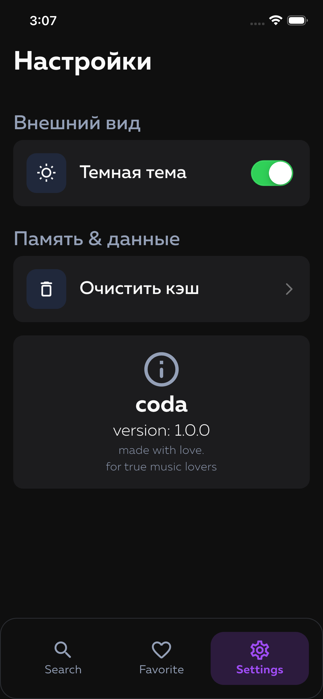

<div align="center">
  <h1>Coda</h1>
  <p><b>Открывайте текст, переводите смысл, наслаждайтесь музыкой</b></p>
  <p><i>Discover lyrics, translate meaning, enjoy music</i></p>
</div>

<div align="center">

[](https://flutter.dev)
[](https://dart.dev)
[](https://resocoder.com/flutter-clean-architecture)

</div>

<hr>

## О Проекте

<b>Coda</b> — приложение для поиска и перевода текстов песен с использованием тройной интеграции API.

Основные возможности:
- Поиск текстов через Genius API
- Синхронизированные тексты с временными метками (LRClib)
- Мгновенный перевод на русский язык (Google Translator)
- Локальное хранилище избранных
- Управление темами оформления
- Кроссплатформенность (iOS, Android, Web)

**Стек:** Clean Architecture, BLoC/Cubit, Hive CE, Dio, AutoRoute, GetIt

---

## About the Project

<b>Coda</b> is a lyrics discovery and translation application powered by triple API integration.

Key features:
- Lyrics search powered by Genius API
- Synchronized lyrics with timestamps (LRClib)
- Instant Russian language translation (Google Translator)
- Local storage for favorites
- Theme management
- Cross-platform support (iOS, Android, Web)

**Stack:** Clean Architecture, BLoC/Cubit, Hive CE, Dio, AutoRoute, GetIt

<hr>

## Тройная интеграция API

| API | Назначение | Функция |
|-----|-----------|---------|
| <b>Genius API</b> | Метаданные трека | Поиск информации о треке: название, обложка, исполнитель |
| <b>LRClib API</b> | Тексты песен | Получение текста песни (plain lyrics, без синхронизации) |
| <b>Google Translator API</b> | Перевод текста | Контекстный перевод с сохранением смысла и структуры |

---

## Triple API Integration

| API | Purpose | Function |
|-----|---------|----------|
| <b>Genius API</b> | Track Metadata | Retrieves track information such as name, cover art, artist |
| <b>LRClib API</b> | Lyrics | Provides plain song lyrics without synchronization |
| <b>Google Translator API</b> | Text Translation | Context-aware translation preserving meaning and structure |

<hr>

## Технический стек

<table>
  <tr>
    <td><b>Framework</b></td>
    <td>Flutter 3.0+</td>
  </tr>
  <tr>
    <td><b>Язык</b></td>
    <td>Dart 3.0+</td>
  </tr>
  <tr>
    <td><b>Управление состоянием</b></td>
    <td>BLoC / Cubit</td>
  </tr>
  <tr>
    <td><b>Сетевые запросы</b></td>
    <td>Dio</td>
  </tr>
  <tr>
    <td><b>Локальное хранилище</b></td>
    <td>Hive CE</td>
  </tr>
  <tr>
    <td><b>Навигация</b></td>
    <td>AutoRoute</td>
  </tr>
  <tr>
    <td><b>Внедрение зависимостей</b></td>
    <td>GetIt</td>
  </tr>
  <tr>
    <td><b>Архитектура</b></td>
    <td>Clean Architecture</td>
  </tr>
</table>

---

## Technical Stack

<table>
  <tr>
    <td><b>Framework</b></td>
    <td>Flutter 3.0+</td>
  </tr>
  <tr>
    <td><b>Language</b></td>
    <td>Dart 3.0+</td>
  </tr>
  <tr>
    <td><b>State Management</b></td>
    <td>BLoC / Cubit</td>
  </tr>
  <tr>
    <td><b>Networking</b></td>
    <td>Dio</td>
  </tr>
  <tr>
    <td><b>Local Storage</b></td>
    <td>Hive CE</td>
  </tr>
  <tr>
    <td><b>Navigation</b></td>
    <td>AutoRoute</td>
  </tr>
  <tr>
    <td><b>Dependency Injection</b></td>
    <td>GetIt</td>
  </tr>
  <tr>
    <td><b>Architecture</b></td>
    <td>Clean Architecture</td>
  </tr>
</table>

<hr>

## Скриншоты / Screenshots

<table>
  <tr align="center">
    <td width="25%">
      
      <b>Поиск / Search</b><br>
    </td>
    <td width="25%">
      
      <b>О треке / Track details</b><br>
    </td>
    <td width="25%">
      
      <b>Избранное / Favorites</b><br>
    </td>
    <td width="25%">
      
      <b>Настройки / Settings</b><br>
    </td>
  </tr>
</table>

<hr>

## Начало работы

### Требования

- Flutter 3.0 или выше
- Dart 3.0 или выше
- iOS 11.0+ (для iOS)
- Android 5.0+ (для Android)
  
### Установка

```bash
git clone https://github.com/workedErnesto/coda.git
cd coda
flutter pub get
flutter run
```

<hr>

<div align="center">
  <p>
    Developed by 
    <a href="https://github.com/workedErnesto">workedErnesto</a> 
    with <b>Flutter</b> and ❤️
  </p>
</div>
